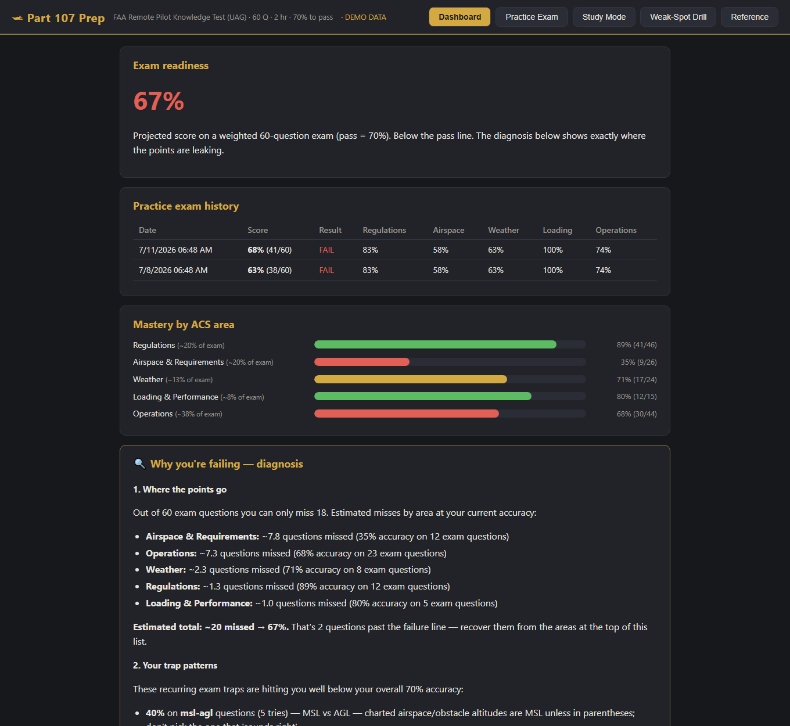
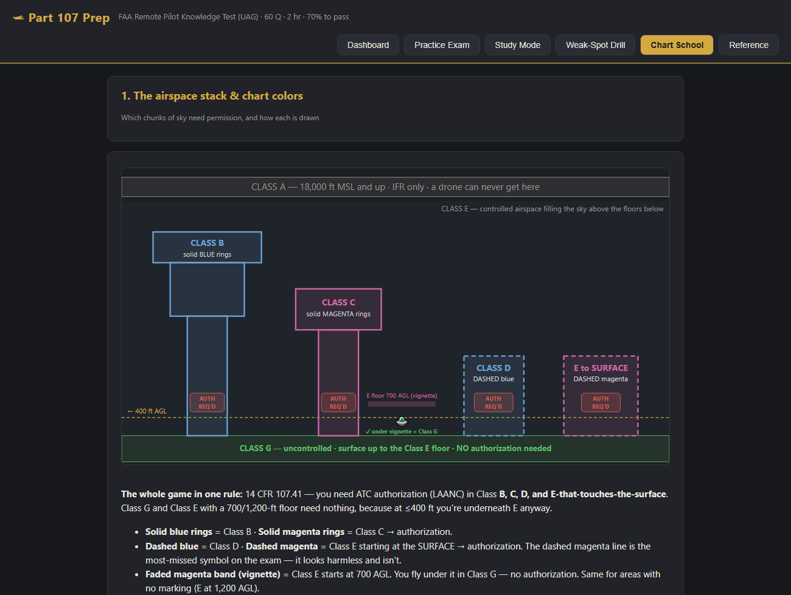

# Part 107 Prep

Study/test trainer for the FAA Remote Pilot (Part 107 / UAG) knowledge exam, with
failure-pattern analysis.

**▶ Live app: https://mikedopp.github.io/Part107Prep/** — runs in any browser, phone or
desktop, no install. Progress saves locally in that browser.

## Run it

Easiest: open the **[live app](https://mikedopp.github.io/Part107Prep/)** above.

To run it locally, double-click **`Start-Part107Prep.cmd`** (starts a local server on
port 8107 and opens the browser), or just open `index.html` directly in Edge/Chrome —
both work; the server version is slightly nicer for viewing the PDF references.

Progress is stored in browser localStorage (per browser, per origin — stick with one
way of opening it so your history stays in one place). `Export progress` on the
Dashboard downloads a JSON backup.

## What's inside

- **167 questions**: all 46 official FAA UAG sample questions (answers verified against
  published keys) + 121 original questions written from the FAA Remote Pilot Study
  Guide / 14 CFR 107. Every question has an explanation, ACS code, topic, subtopic,
  and "trap" tags (MSL-vs-AGL, true-vs-magnetic, units, stable-vs-unstable, etc.).
- **Practice Exam**: 60 questions drawn with real exam weighting (Regs 12, Airspace 12,
  Weather 8, Loading 5, Operations 23), 2-hour countdown, flagging, question grid,
  auto-submit at time-out, full review with explanations.
- **Study Mode**: untimed, instant feedback, by topic or figures-only.
- **Weak-Spot Drill**: re-serves every question you've missed until you answer it
  correctly twice in a row.
- **Dashboard**: projected exam score, per-area mastery bars, exam history, and the
  "Why you're failing" diagnosis — points lost per area, trap-pattern detection,
  weakest subtopics, and a study prescription.
- **Chart School**: 8 visual lessons on reading sectional charts and METARs —
  airspace colors, data blocks, MSL vs AGL, obstacles/MEF, special-use airspace,
  lat/long plotting, traffic patterns, and an interactive METAR decoder. Each lesson
  pairs custom diagrams with spotlight crops from the real FAA testing-supplement
  figures and drills you on the matching questions.

- **Figures**: the 8 testing-supplement figures the FAA questions reference
  (sectionals, METAR block, load-factor chart) rendered at 200 DPI in `figures/`,
  shown in a click-to-zoom viewer.
- `faa_docs/`: local copies of the FAA Study Guide and the official sample-question
  PDF. The full CT-8080-2H testing supplement (176 MB) exceeds GitHub's file-size
  limit — run `faa_docs/Get-Supplement.cmd` to download it from faa.gov.

All FAA source documents are U.S. government works (public domain).

## Question bank files

`qbank_faa.js` (official), `qbank_reg.js`, `qbank_air.js`, `qbank_wx.js`,
`qbank_load.js`, `qbank_ops.js`, `qbank_charts.js`. Add questions by appending
objects with the same shape; `id` must be unique. Chart School lessons live in
`charts.js`.

## Real exam logistics

60 questions · 2 hours · 70% to pass · $175 at a PSI testing center
(faa.psiexams.com) · government photo ID · you receive the printed CT-8080-2H figure
book at the center. Unanswered = wrong, so never leave blanks. After passing, complete
FAA Form 8710-13 in IACRA to get the certificate; TSA vetting follows.
