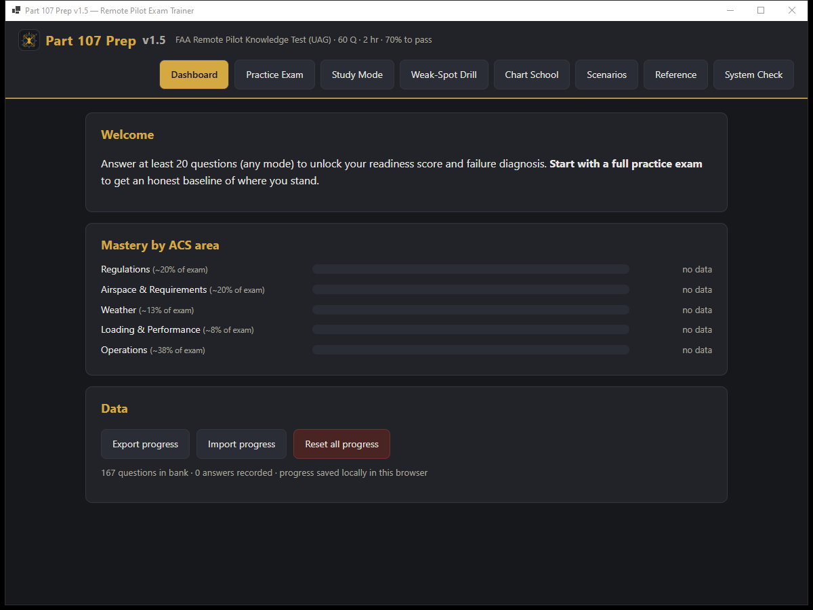
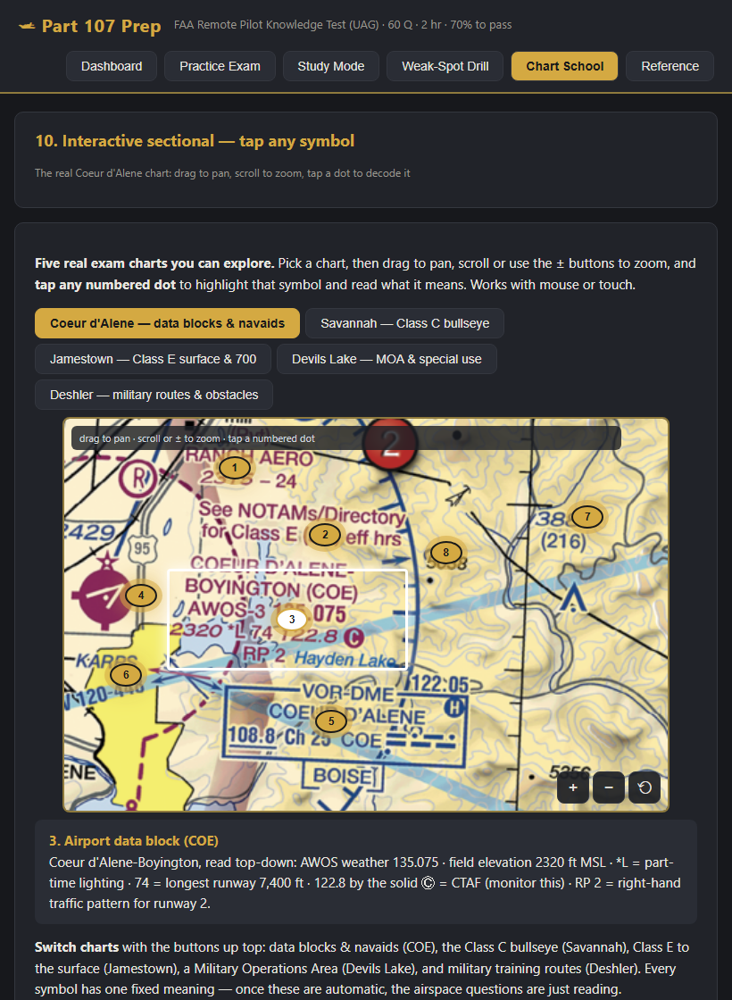
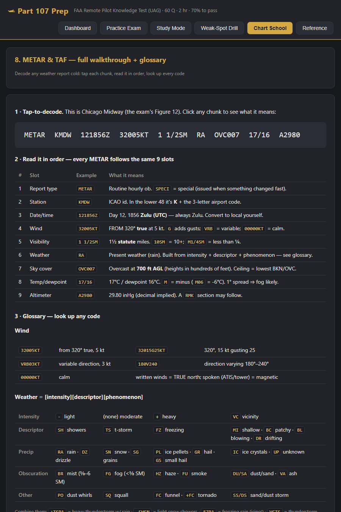
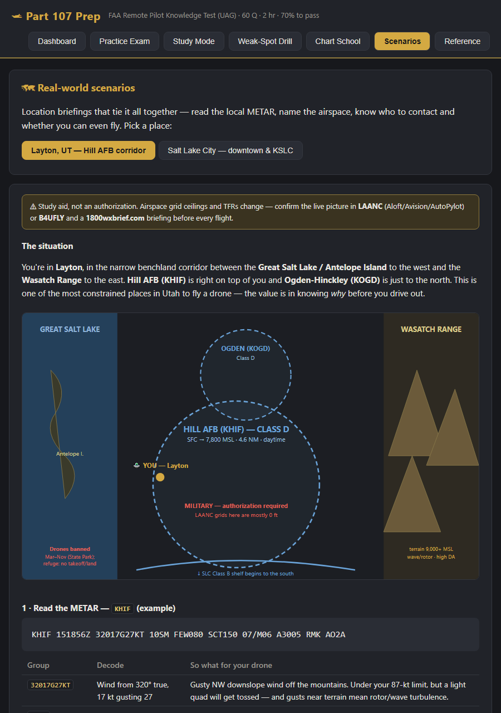

# Part 107 Prep v1.5

Study/test trainer for the FAA Remote Pilot (Part 107 / UAG) knowledge exam, with
failure-pattern analysis.

**▶ Live app: https://mikedopp.github.io/Part107Prep/** — runs in any browser, phone or
desktop, no install. Progress saves locally in that browser.

## Run it — three ways

1. **Web (any device):** open the **[live app](https://mikedopp.github.io/Part107Prep/)**. No install; works on your phone.
2. **Desktop app (Windows):** double-click **`Build-App.cmd`** to restore, build,
   publish, and verify the app. Run `app\publish\v1.5\win-x64\Part107Prep.exe`. The
   publish is one self-contained executable with the complete offline site embedded.
   The Edge WebView2 runtime is the only external runtime dependency. The app's
   **System Check** page reports the detected version and every storage/content path.
3. **Local browser:** double-click `Start-Part107Prep.cmd` (serves on port 8107), or just
   open `index.html` in Edge/Chrome.

Progress is stored locally per app/browser. Dashboard **Export progress** and guarded
**Import progress** let you move the same JSON history between the webpage and desktop
app without losing exam attempts.

## Dependencies, with the lights on

### Running the Windows app

- Windows x64.
- Microsoft Edge WebView2 Runtime. The app detects it at startup and displays the exact
  version in **System Check**.
- Write access to `%LOCALAPPDATA%\Part107Prep`. Embedded study content is extracted to a
  versioned private folder there; WebView2 keeps its persistent profile there too.
- Internet is **not required** for questions, exams, charts, scenarios, PDFs, or saved
  progress. It is needed only when opening external FAA, LAANC, weather, source, or PSI
  links.

The .NET runtime and offline `wwwroot` content are embedded in `Part107Prep.exe`. There
is no dependency folder to keep beside the application.

### Rebuilding the Windows app

- .NET 8 SDK on `PATH`.
- NuGet access for the initial WebView2 package restore.
- `Build-App.cmd` prints the builder version, then performs restore, build, publish, and
  output verification.

### Running the webpage

- A current browser with JavaScript and localStorage enabled.
- Any ordinary static host. `Start-Part107Prep.cmd` provides a local server on port 8107.

## What's inside

- **167 questions**: all 46 official FAA UAG sample questions (answers verified against
  published keys) + 121 original questions written from the FAA Remote Pilot Study
  Guide / 14 CFR 107. Every question has an explanation, ACS code, topic, subtopic,
  and "trap" tags (MSL-vs-AGL, true-vs-magnetic, units, stable-vs-unstable, etc.).
- **Practice Exam**: 60 questions drawn with real exam weighting (Regs 12, Airspace 12,
  Weather 8, Loading 5, Operations 23), 2-hour countdown, flagging, question grid,
  auto-submit at time-out, full review with explanations.
- **Study Mode**: untimed, instant feedback, by topic or figures-only.
- **Weak-Spot Drill**: re-serves every question you've missed until you answer it
  correctly twice in a row.
- **Dashboard**: projected exam score, per-area mastery bars, exam history, and the
  "Why you're failing" diagnosis — points lost per area, trap-pattern detection,
  weakest subtopics, and a study prescription.
- **Chart School**: 11 visual lessons on reading sectional charts and weather — airspace
  colors, data blocks, MSL vs AGL, obstacles/MEF, special-use airspace, lat/long
  plotting, traffic patterns, a **full METAR & TAF walkthrough with a code glossary**,
  and a **nasty-weather deep dive** (+TSRA heavy thunderstorm and FZRA freezing rain
  decoded character-by-character, plus a complete TAF read to plan a flight window
  around them) — plus two hands-on chart tools:
  - **Chart Detective** — an animated guided tour that steps through the real Savannah
    Class C chart one symbol at a time, a pulsing highlight gliding to each feature.
  - **Interactive sectional** — **11 real exam charts**: five close-up crops *and all six
    full-size FAA testing-supplement pages* (the exact pages handed to you at the PSI
    center), each with tappable decoded hotspots. **Drag to pan, scroll/pinch to zoom,
    tap any numbered symbol.** Works with mouse and touch.

  Lessons use animated diagrams (respecting `prefers-reduced-motion`) plus spotlight
  crops from the real FAA testing-supplement figures, and drill you on the matching
  questions. Chart facts were cross-checked against FAA sources.

- **Scenario Lab v1.5**: six guided mission briefings use current FAA sectional crops,
  semantic numbered overlays, fixed exam-style METARs, a pilot verdict, and two short
  knowledge checks. Every chart callout answers **what it is / what it means / what you
  do** in plain English. Locations: **Layton**, **Salt Lake City**, **Bear Lake / Garden
  City**, **Yellowstone / Old Faithful**, **Uptown Charlotte**, and **Central Park /
  Manhattan**. Three original Utah briefings remain as bonus scenarios: Ogden Canyon,
  Provo, and Antelope Island. The METARs are explicitly training examples, not live
  weather, and every mission separates FAA airspace from launch-site permission.

  The four new map crops are clean FAA chart pixels with no baked-in annotations.
  Exact source packages, crop boxes, dimensions, hashes, coverage caveats, and hotspot
  rectangles are recorded in `docs/v1.5-map-sources.md`.

- **Figures**: the 8 testing-supplement figures the FAA questions reference
  (sectionals, METAR block, load-factor chart) rendered at 200 DPI in `figures/`,
  shown in a click-to-zoom viewer.
- `faa_docs/`: local copies of the FAA Study Guide and the official sample-question
  PDF. The full CT-8080-2H testing supplement (176 MB) exceeds GitHub's file-size
  limit — run `faa_docs/Get-Supplement.cmd` to download it from faa.gov.

All FAA source documents are U.S. government works (public domain).

## Question bank files

`qbank_faa.js` (official), `qbank_reg.js`, `qbank_air.js`, `qbank_wx.js`,
`qbank_load.js`, `qbank_ops.js`, `qbank_charts.js`. Add questions by appending
objects with the same shape; `id` must be unique. Chart School lessons (and the
Chart Detective tour hotspots) live in `charts.js`; the desktop shell is in `app/`.

## Real exam logistics

60 questions · 2 hours · 70% to pass · approximately $175 at a PSI testing center
(faa.psiexams.com) · government photo ID · you receive the printed CT-8080-2H figure
book at the center. Unanswered = wrong, so never leave blanks. After passing, complete
FAA Form 8710-13 in IACRA to get the certificate; TSA vetting follows.
